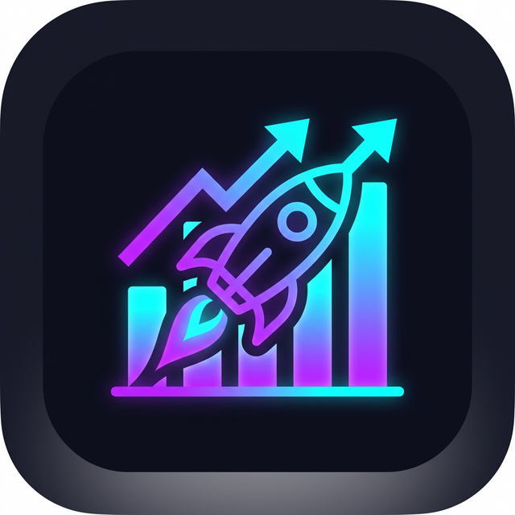

# 🚀 Focus Tracker Pro: The Ultimate Productivity Suite

Focus Tracker Pro is a gamified, high-performance mobile application built with **React 19**, **Expo SDK 54**, and **React Navigation 7**. Designed for warriors of focus, it combines deep workflow tracking with immersive ambient audio and a quest-based progression system.



## ✨ Core Features

### 🧘 Zen Sanctuary (New)
An immersive focus environment featuring:
- **Premium Ambience**: Lo-Fi, Rain, Cyber-Ambient, and Deep Zen loops.
- **Resonance Breathing**: A high-fidelity visualizer to guide 4-4-4-4 cadence for maximum focus.
- **Deep Session Analytics**: Tracking focus intensity and audio immersion time.

### ⚔️ Focus Quests
Gamification of your productivity journey:
- **XP Progression**: Earn XP for every study block and completed habit.
- **Leveling System**: Transform from a Novice into a "Legend of Focus".
- **Quest Log**: Manage Daily and Epic milestones specialized for Data Science and deep learning goals.

### 🛡️ Focus Shield (Android)
Hardware-level focus enforcement:
- **App Interventions**: Automatically blocking distracting apps during study blocks.
- **Usage Statistics**: Real-time monitoring of distracting apps vs. productivity time.
- **App Limits**: Set strict daily time caps for social media.

### 📊 Professional Analytics
- **Historical Data**: Deep insights into your focus habits over weeks and months.
- **Heatmaps & Ranks**: Visualizing your consistency (Streak logic) and Warrior Rank.

## 🛠️ Technical Stack
- **Framework**: React 19 / React Native 0.81
- **Engine**: Reanimated 4 & Worklets 0.5.1
- **Navigation**: React Navigation 7 (Drawer + Bottom Tabs)
- **State**: React Context with AsyncStorage persistence
- **Styling**: Custom Antigravity Obsidian/Neon Theme

## 📥 Getting Started

1. **Clone the repository**:
   ```bash
   git clone <REPOSITORY_URL>
   cd Focus-Tracker-Pro
   ```

2. **Install Dependencies**:
   ```bash
   npm install --legacy-peer-deps
   ```

3. **Launch the Application**:
   ```bash
   npx expo start -c
   ```

4. **Environment Check**:
   Run `npx expo-doctor` to ensure 100% synchronization.

## ⚖️ License
Designed and Developed with the Antigravity Design Philosophy.
🛡️🚀⚖️
